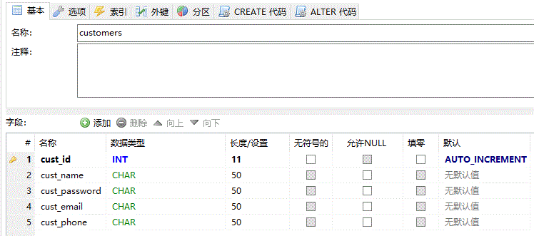
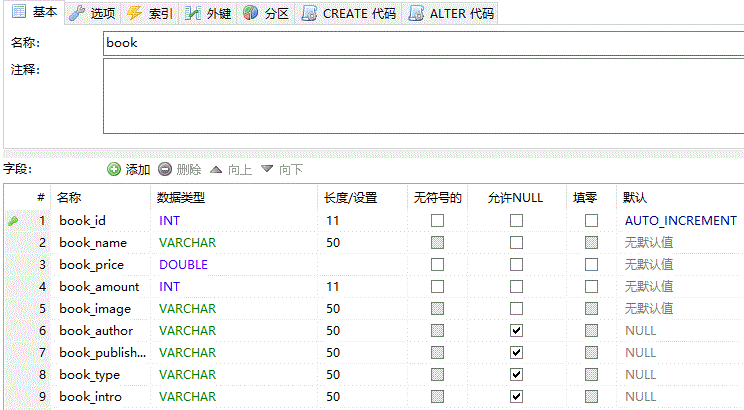
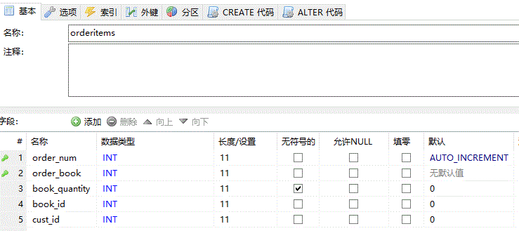

<html>
	<head>
		<meta charset="utf-8">
	</head>
	<body>
		<h3>BOOK STORE demo</h3>
		<h4>版本：struts2 v1.0</h4>
		<h4>特点：</h4>
		<h5>1、采用struts2框架编写的一个小型书店网站；基本使用table方式进行页面布局</h5>
		<h5>2、jsp页面中用OGNL表达式取代EL表达式；</h5>
		<h5>3、注册、登录功能采用了struts2的验证机制：validateXxx-validate-xxx</h5>
		<h5>4、编写并配置了两个拦截器LoginInterceptor和CheckCodeInterceptor</h5>
		<h4>缺点：</h4>
		<h5>1、购物车页面全选等显示待补全；</h5>
		<h5>2、搜索、分类、购买等功能未实现；</h5>
		<h5>3、ognl表达式在部分代码处未实现出想要的功能；</h5>
		<h4>实现的功能：</h4>
		<h5>1、注册、登录、退出（包括进行简单的注册验证、登陆验证）；</h5>
		<h5>2、购物车（包括添加进购物车和显示用户购物车商品页面）；</h5>
		<h4>使用的数据库表：customers、book、orderitems，如下：</h4>
		<h5 align="center">customers</h5>
		

		<h5 align="center">book</h5>
		

		<h5 align="center">orderitems</h5>
		

	
	</body>
</html>